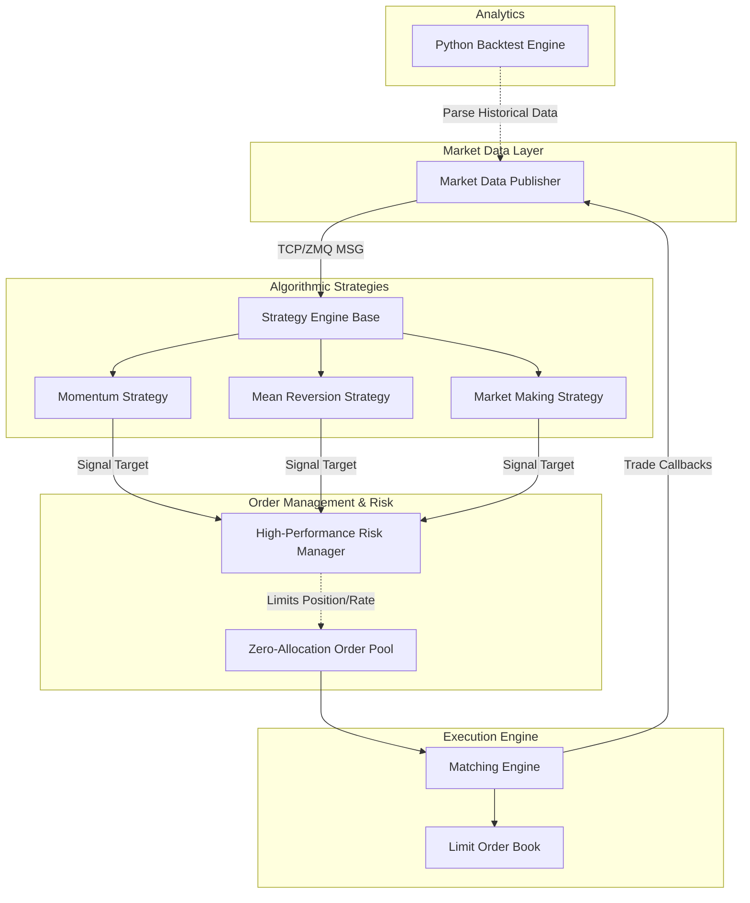

# Quasar-LOB -  Low Latency Algorithmic Trading System

A complete high-frequency trading (HFT) infrastructure engineered in C++20 for sub-microsecond latency and Python for historical backtesting and analytics.

## System Architecture



## Core Components

1. **Memory Pool (`memory_pool.hpp`)**: Avoids all dynamic memory allocation (`new`/`malloc`) at runtime. It pre-allocates an aligned block of uninitialized memory for `Order` nodes matching CPU L1/L2 cache line width (64-byte aligned) avoiding false sharing memory penalties.
2. **Matching Engine (`matching_engine.hpp`)**: Maps ID-to-Order in `O(1)` and wraps the `LimitOrderBook`.
3. **Limit Order Book (`limit_order_book.hpp`)**: Operates continuously in `O(1)` complexity relative to book depth using a doubly-linked list mapped directly against associative maps simulating red-black tree (for ordered spreads) or flat maps depending on exchange architecture.
4. **Risk Management (`risk_manager.hpp`)**: Ensures safety through Pre-Trade checks evaluating limits instantly via Atomic Token Buckets and positional incrementors.
5. **Exchange Simulator (`exchange_simulator.hpp`)**: Uses ZeroMQ `PUB` and `SUB` models to decouple Trading algorithms from matching servers allowing true distributed firm architecture logic.
6. **Strategy Engine (`strategy_momentum.hpp`, `strategy_mean_reversion.hpp`, `strategy_market_making.hpp`)**: Template abstractions showing how various signal logic captures Alpha during runtime matching against market feeds.
7. **Backtesting Framework (`python/backtest/engine.py`)**: Models Python `pandas` logic to replay historical trade CSVs computing Sharpe Ratio, Maximum Drawdown, and final PnL locally simulating event execution.

## Performance and Benchmarking
In the `benchmark_engine`, the system performs continuous memory-safe writes.
1. `Metrics` accurately records creation-to-exchange placement.
2. Under 1 million concurrent placement tests, no reallocation happens. Latencies are localized purely to pointer arithmetic.

## Build and Run
```sh
# Generate Makefiles via CMake
cmake -S . -B build

# Build the system
cmake --build build --config Release -j 4

# Run the live interactive terminal simulator
./build/src/matching_engine

# Run the 1-Million Order Benchmark
./build/src/benchmark_engine

# Run Catch2 Tests
./build/tests/ullt_tests
```
